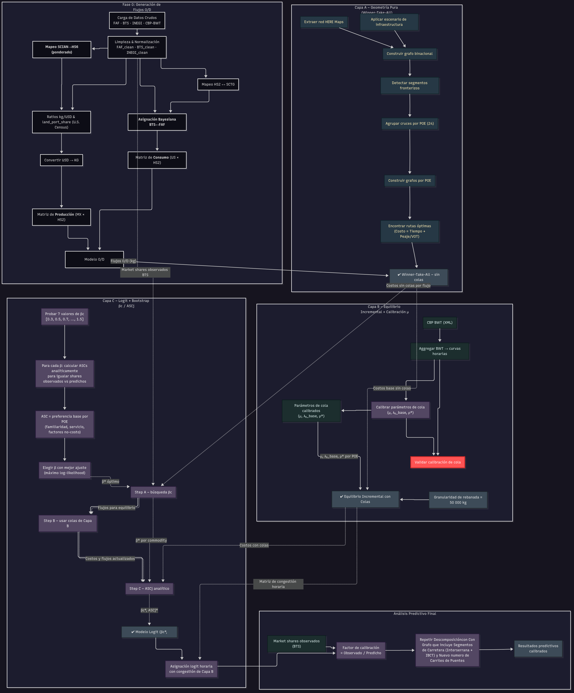
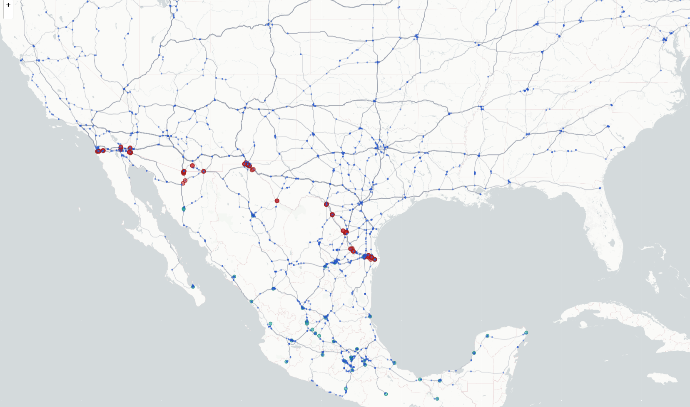

[← Inicio](./)

# Centro de Integración Estratégica Norteamericana
**Documentación Técnica Completa**

---

## Resumen Ejecutivo

La reconfiguración de cadenas de suministro globales hacia Norteamérica presenta la mayor oportunidad de crecimiento económico para México en décadas, pero la fragmentación de datos oficiales entre múltiples agencias gubernamentales (BTS, Census, INEGI, CBP, FAF, SICT) impide la toma de decisiones estratégicas informadas sobre inversiones en infraestructura fronteriza. Sin una fuente integrada que revele con granularidad necesaria qué flujos de carga viajan desde cada estado mexicano hacia cada región estadounidense y por qué puerto fronterizo cruzan, las decisiones de inversión en puentes, vialidades y servicios logísticos se basan en intuición más que en análisis predictivo cuantitativo.

CIEN resuelve esta limitación mediante la integración de datos dispersos en un modelo logístico unificado que simula el sistema completo de exportaciones mexicanas a Estados Unidos por camión. El sistema procesa 56 millones de toneladas de flujos comerciales de exportación sobre una red vial de 399,972 kilómetros, aplicando una metodología de descomposición causal de tres capas que aísla y cuantifica los factores determinantes de competitividad entre puertos fronterizos: geometría de red, restricciones de infraestructura, y comportamiento logístico diferenciado por tipo de mercancía. Esta arquitectura permite proyectar con precisión cuantitativa el impacto de nuevas inversiones en infraestructura sobre la redistribución de flujos comerciales de exportación y la captura de participación de mercado en corredores estratégicos.

El modelo establece aproximadamente 170,000 flujos únicos de exportación que representan la totalidad del comercio terrestre de México hacia Estados Unidos, asignándolos dinámicamente a 21 puertos de entrada mediante algoritmos que incorporan colas operativas, capacidad de carriles, programas de facilitación comercial y variaciones horarias. El resultado es un sistema determinista y reproducible que cuantifica exactamente cómo cambios específicos en infraestructura redistribuyen toneladas exportadas, tiempos de tránsito y costos logísticos a través de la frontera, proporcionando la base analítica necesaria para optimizar decisiones de inversión de capital en el contexto del nearshoring y la convergencia de infraestructura norteamericana.

---

## Navegación Rápida
- [Visión Estratégica](#vision)
- [Arquitectura del Sistema](#arquitectura)  
- [Metodología Completa](#metodologia)
- [Validación de Datos](#validacion)

---

## Visión Estratégica {#vision}

México y Estados Unidos se encuentran ante una coyuntura sin precedentes y nuestro análisis (CIEN) identificó una convergencia de infraestructura de relevancia estratégica excepcional para el proyecto INOVUS —el corredor de puentes internacionales (IBTC) en el condado de Hidalgo TX, la duplicación del puente Reynosa-Pharr y la carretera Interserrana al sur de Monterrey— están a punto de reconfigurar las ventajas relativas de los cruces fronterizos. Estos hallazgos confirman la visión previa y anticipada con la que se estructura el proyecto estratégico de dos fases a mediano plazo ubicado precisamente donde la convergencia logística genera el máximo impacto: 8km al sur del Puente Internacional Reynosa-Pharr,  envolviendo infraestructura de distribución crítica que conecta Monterrey-Victoria-Matamoros.

---

## Arquitectura del Sistema CIEN {#arquitectura}



---

## Metodología Completa {#metodologia}

# Establecimiento de Universo

Para este análisis integramos, en una sola base relacional, las series oficiales que describen comercio, red carretera y operación fronteriza. La evidencia proviene de BTS DOT‑3 (valores/pesos por puerto, modo y HS2), U.S. Census (comercio bilateral y portuario mensual), INEGI – exportaciones estatales por SCIAN (trimestral), CBP (camiones cargados/vacíos), FAF (tonelaje/valor por región y modo) y SICT Datos Viales (TPDA y composición vehicular), además de cartografía operativa. Todo se armoniza en una dimensión temporal común y en llaves normalizadas de producto (HS2/HS4/HS6 ↔ SCIAN ↔ SCTG), geografía (país–estado–región FAF–puerto) y modo de transporte, preservando trazabilidad de origen, sello temporal y reglas de transformación. Cuando existe incertidumbre de mapeo, se declara método y nivel de confianza. Las salidas aquí presentadas reflejan estrictamente ese universo: datos oficiales normalizados y reconciliados.

La unidad fundamental del modelo es el **flujo**: una combinación específica de (Ciudad_Mexicana, Región_FAF_Estadounidense, HS2) → kg. Cada flujo representa el volumen total de un producto específico que se mueve desde un estado productor en México hacia una región de demanda en Estados Unidos. Por ejemplo: "Silao → Houston → Electrónicos (HS2-85) → 2.3M kg" constituye un flujo individual. El modelo analiza aproximadamente 170,000 flujos únicos que, en conjunto, representan los 56M de toneladas del universo comercial. Cada flujo debe elegir un **puerto de entrada/puente** (POE) para cruzar la frontera, y es esta decisión de enrutamiento lo que determina la participación de mercado de cada cruce fronterizo. La decisión es representada en el modelo como una **Ruta**: La ruta es el Conjunto de segmentos específicos sobre los cuales los flujos se desplazan. Cada segmento tiene asociado un valor de tiempo, distancia y en ocasión costo de peaje.

## Establecer Flujos: Proceso de Tres Fases

Dado que no existe una fuente oficial única que establezca estos flujos de manera directa, el modelo unifica datos aislados de diversas agencias gubernamentales y aplica inferencias controladas para reconciliarlos. El proceso se estructura en tres fases claramente definidas:

## FASE 1: Matriz de Producción (México)

En esta primera fase establecemos **qué produce cada estado mexicano para exportación a Estados Unidos por camión**.

Para aproximar el origen, se realiza una serie de transformaciones a los datos de exportaciones por estado de INEGI, cuyos reportes vienen en código SCIAN y USD, sin segmentación por país destino o modo de transporte utilizado. El proceso comienza con la preparación de insumos clave: convertimos los valores estatales reportados por INEGI en clasificación SCIAN a kilogramos por HS2, aplicando un mapeo SCIAN→HS6→HS2, filtros de proporción terrestre y factores kg/USD derivados de datos del Censo.

### Metodología de Mapeo SCIAN a HS6

Para aproximar el origen, se realiza una serie de transformaciones a los datos de exportaciones por estado de INEGI(ETEF_Entidad_Subsector_Origen_Exportaciones_MX), cuyos reportes vienen en código SCIAN y USD, sin segmentación por país destino o modo de transporte utilizado. Primero llevamos a cabo un mapeo "many to many" de la clasificación SCIAN 3 dígitos a clasificación HS6 que asigna múltiples categorías de comercio por cada industria.

#### Distribución Ponderada y Filtros de Transporte

Para abordar la diferencia de nivel de detalle entre ambas clasificaciones y la irrelevancia comercial relativa de muchos de los mapeos, el modelo distribuye el valor total exportado en un estado por cada codigo SCIAN reportado y lo distribuye a traves de todos los codigos HS6 vinculados. Es una distribucion ponderada de acuerdo a las importaciones estadounidenses observados por Census de ese producto. Para evitar contaminar el modelo con productos que no se transportan en camión, cada valor ponderado se multiplica por la **proporción histórica que cruza la frontera por camión**.  Esta proporción se calcula restando explícitamente el valor ferroviario (BTS DOT-1) del comercio terrestre reportado por Census, de modo que el numerador refleja sólo flujos de camión.

El resultado de ese filtro es que la porcion del valor de exportacion de un estado esta asociada a productos que mayoritariamente se mueven por mar o aire se reduce al valor que se mueve por tierra, y en algunos casos se elimina por completo. De esta forma, solo se conserva el volumen de carga relevante para el analisis de transporte por camion.

Cabe destacar que la fracción terrestre se calcula exclusivamente a partir de importaciones de EE. UU. desde México; por lo tanto, al aplicarla sobre las cifras de INEGI se eliminan, de forma implícita, las exportaciones mexicanas dirigidas a otros países (marítimas o aéreas al resto del mundo).  El remanente representa, con buena aproximación, los flujos que realmente terminan en el mercado estadounidense por camión.

#### Resultados del Mapeo SCIAN→HS6

El proceso logra una tasa de éxito del 100% en la conversión de códigos SCIAN a HS-6. Todos los registros de valor de INEGI encuentran correspondencias válidas en el sistema de clasificación arancelaria.

#### Cálculo de Pesos y Ajustes Deterministas

En este punto del proceso, tenemos USD por HS6 que se exporta en camion por Estado. Antes de agregar a HS2, el modelo aprovecha la granularidad que ofrece Census en HS6 para  llamar a una funcion externa que aproxima USD/Kg por HS6. La función calcula una relación kg/USD precisa para cada código HS6 utilizando entradas en los datos del Censo solamente si incluyen ambos peso y valor. También filtra embarques anómalos para asegurar que los promedios reflejen condiciones representativas.

El cálculo kg/USD se complementa con un ajuste determinista por HS-2 anclado a la serie BTS DOT-3.  Para cada HS-2 se estima primero un factor bruto = (kg observados ÷ kg estimados) sobre el período 2018-23; luego se aplica un factor de encogimiento λ∈[0,1] de forma que factor_final = factor_base × (1 + λ·(bruto-1)).  El valor λ se busca por grid-search global (0, 0.25, 0.5, 0.75, 1) minimizando el wMAPE fuera de muestra (ventana 2024-01→2025-03). El modelo sacrifica algo de ajuste dentro de la muestra del periodo de analisis —el wMAPE interno sube de 1 % a 12 %— pero la ganancia predictiva es sustancial: el wMAPE fuera-de-muestra baja de 18 % a 10%. Todas las métricas (dentro de muestra primario, dentro de muestra calibrado, fuera de muestra) se imprimen al final de cada corrida junto con el λ óptimo, dejando un rastro completo de auditoría.

#### Agregación Final a HS2

Finalmente, los resultados se agregan de HS6 a HS2 y el resultado es una estructura de datos (Ciudad_Mexicana, HS2) -> total_kg

## FASE 2: Matriz de Demanda (Estados Unidos)

En esta segunda fase establecemos **qué demanda cada región estadounidense de productos mexicanos por camión**.

Para la demanda, extraemos los kilogramos por HS2 y estado destino de BTS-DOT2, redistribuyéndolos a nivel de regiones FAF mediante una posterior basada en distribuciones SCTG.

### Identificación de Flujos por Estado Estadounidense

En esta fase primero se responde:

"Por cada HS2, que estado estadounidense lo recibio por camion de Mexico, y cuantos kg recibio?"

El modelo simplemente consulta la tabla de BTS con los filtros precisos necesarios para contestar la pregunta.

### Desagregación FAF y Asignación Bayesiana

Despues, para lograr una mucho mayor precisión en la asignación de flujos o/d, usamos los datos de FAF para desaggregar los flujos de nivel estado a nivel ciudad/region. Esto es especialmente relevante dado que Houston y Dallas son los dos principales destinos desde Tamaulipas (y en general), y juntarlos en un solo centroide de Texas oculta diferencias clave.

El sistema reconcilia dos fuentes de datos distintas a través de un proceso de asignación Bayesiana que se ejecuta directamente en la base de datos. Por un lado, tenemos los datos de BTS, que nos dan el qué (HS2) y el cuánto (kg). Por otro, tenemos los datos de FAF, que nos dan el dónde (la distribución espacial a regiones FAF específicas como 'Houston' o 'Dallas'), aunque con una clasificación de productos menos granular (códigos SCTG).

El modelo consulta la base de datos y utiliza los códigos SCTG como un puente para conectar ambos mundos. Se calcula la posterior de FAF, es decir, qué proporción de cada grupo de productos SCTG se dirige a cada región FAF. Luego, esta distribución espacial se utiliza para repartir los totales de kg, mucho más precisos y a nivel HS2, que provienen de BTS.

### Matriz de Consumo de Alta Granularidad

El resultado de este cálculo es una nueva Matriz de Consumo de alta granularidad que define, para cada producto HS2, la demanda exacta en kg para cada región FAF individual. Es esta matriz granular, y no los totales a nivel estado, la que el modelo de gravedad utiliza como su "verdad fundamental" para el lado del destino. Asegurando que el modelo primero envíe la carga al estado correcto y redistribuya esos flujos a las regiónes económica correcta dentro del mismo.

## FASE 3: Calibración y Generación de Flujos Origen-Destino

En esta tercera fase construimos la **matriz de origen-destino (O/D)** que define cuánto se mueve de cada estado mexicano a cada región estadounidense para cada tipo de producto.

A partir de los insumos de las fases anteriores, generamos una matriz origen-destino utilizando el principio de gravedad, donde el flujo entre un origen i y destino j se calcula como proporcional al producto de producción y demanda, dividido por el costo elevado a un parámetro β. Probamos múltiples valores de β candidatos y aplicamos un algoritmo de ajuste proporcional iterativo (IPF) para garantizar que las sumas por filas y columnas coincidan exactamente con las restricciones observadas.

## Del Agregado al Detalle: El Motor de Asignación de Flujos

En este punto del proceso, el modelo tiene dos piezas de información: cuánto produce cada estado mexicano (Fase 1) y cuánto demanda cada región estadounidense (Fase 2). La asignación de estos totales agregados en flujos específicos origen-destino requiere un proceso computacional que balancea múltiples restricciones del mundo real.

### Arquitectura del Proceso de Generación

El sistema utiliza un modelo de gravedad con restricciones de destino (`DestinationConstrainedODModel`) que opera en tres etapas secuenciales:

**Etapa 1: Verificación de Caché y Dependencia de Infraestructura**
El modelo verifica si existen flujos calculados para el escenario de infraestructura actual mediante un hash único. Cualquier cambio en la red vial (nuevo puente, mejora en carreteras, cambio en tiempos de recorrido) invalida los flujos previos y fuerza un recálculo completo. Esto garantiza que las decisiones de inversión se basen en la realidad física actualizada de la red.

**Etapa 2: Generación de Matriz Semilla mediante Modelo de Gravedad**
El modelo crea una estimación inicial de flujos usando la fórmula de gravedad:

```
Flujo = (Producción × Demanda) / (Costo ^ Beta)
```

Los flujos son proporcionales al tamaño de los mercados (producción × demanda) pero decaen con la fricción de la distancia (costo elevado a beta). Cada tipo de mercancía tiene su propio parámetro beta que refleja su sensibilidad a la distancia. Productos perecederos exhiben beta alto, mientras que electrónicos muestran beta bajo.

**Etapa 3: Balance Iterativo - Reconciliando Múltiples Verdades**
La matriz semilla inicial raramente coincide con los totales observados. Aquí surge un desafío fundamental: tenemos dos "verdades" que deben respetarse simultáneamente:
- Cada estado mexicano debe exportar exactamente lo que INEGI reporta
- Cada región estadounidense debe importar exactamente lo que BTS/FAF indica

### ¿Por Qué es Necesario un Balance Iterativo?

**El problema**: La estimación inicial basada en gravedad sugiere flujos "naturales" entre orígenes y destinos, pero estos raramente suman a los totales observados. Por ejemplo, el modelo podría sugerir que Guanajuato debería exportar 100M kg, pero INEGI reporta 120M kg. Simultáneamente, podría sugerir que Houston debería recibir 80M kg cuando BTS indica 75M kg.

**La solución**: Un proceso de ajuste proporcional iterativo (IPF por sus siglas en inglés) que preserva las proporciones relativas mientras garantiza que ambas restricciones se cumplan exactamente. Es como ajustar una fotografía para que quepa en un marco específico sin distorsionar las proporciones internas.

**El resultado**: Una matriz que respeta tanto los datos de producción mexicana como los de demanda estadounidense, manteniendo patrones comerciales realistas. Por eso el modelo puede reportar errores de 0% en los totales mientras mantiene coherencia en los flujos individuales.

### Implicaciones del Diseño

**Determinismo y Reproducibilidad**: El proceso es 100% determinista. Dados los mismos inputs (producción, demanda, costos, betas), el resultado será idéntico. No hay elementos aleatorios. Esto permite consistencia y auditabilidad en decisiones de inversión.

**Sensibilidad a Infraestructura**: La dependencia del infrastructure_hash significa que el modelo captura cómo cambios en la red vial redistribuyen flujos comerciales. Un nuevo puente no solo añade capacidad - reorganiza patrones comerciales en la frontera.

**Respeto a Datos Observados**: El proceso IPF garantiza que el modelo nunca viola la realidad observada. Si los datos indican que Texas importa X toneladas de acero, eso es lo que recibirá en la matriz final, independientemente de las preferencias del modelo de gravedad.

## Construcción de la Matriz Origen-Destino

Esta fase construye la matriz de origen-destino (O/D) que define cuánto se mueve de cada estado mexicano a cada región estadounidense para cada tipo de producto (HS2). Para lograrlo, el modelo combina: producción (fase 1 - confianza: media), demanda (fase 2 - confianza: alta) y distancia.

### ¿Por Qué Priorizar la Precisión del Origen?

**Decisión estratégica clave**: El modelo "cierra" (fija al 100 %) los totales de producción por estado mexicano y permite un pequeño error en los totales de destino estadounidense.

**Por qué cerrar el origen**: Los volúmenes de exportación parten de INEGI, pero antes de entrar al modelo atraviesan (1) un mapeo SCIAN→HS6→HS2 y (2) una conversión USD→kg. Ambos pasos introducen ruido inevitable en la desagregación, aunque el total kg queda calibrado contra BTS. Si dejáramos que el algoritmo reajuste esos orígenes, acumularíamos distorsiones y perderíamos la trazabilidad de la etapa de mapeo. Al forzar que cada estado conserve exactamente su masa exportada, contenemos ese error y preservamos la coherencia de la base de producción.

**Por qué aceptar un pequeño error en destino**: Para los destinos contamos con datos observados ya en la dimensión exacta requerida (HS2 × estado) gracias a BTS y a la posterior desagregación FAF. Un desajuste residual del 10–20 % refleja principalmente la fricción por distancia que estamos calibrando (β), no una pérdida de masa. El desajuste evita un sobre-ajuste. El β de cada HS2 se entrena con la demanda **del año previo** (jun-2023→mar-2024) y se evalúa contra la demanda **del año corriente** (jun-2024→mar-2025).  Un error ≈15 % indica capacidad predictiva real, ya que si se obligara a bajar a 0% estaríamos simplemente reproduciendo el año de entrenamiento y el modelo fallaría al proyectar escenarios futuros (nuevas capacidades, shocks de demanda, etc.).

[AGREGAR: Tabla de resultados de calibración del Modelo de Gravedad (β de gravedad). Incluir wMAPE de destino, λ óptimo y métricas de validación fuera de muestra.]

Habiendo concluido este proceso de asignación de flujos por origen, destino y HS2, se logran establecer las condiciones sobre las cuales los puertos de entrada terrestre, y sus ciudades fronterizas correspondientes, compiten por el valor economico que representa el procesamiento de los flujos logisticos.

# Descomposición Causal de Flujos

Una vez establecida la matriz origen-destino, el modelo ejecuta un análisis de descomposición causal para entender **por qué** cada puerto fronterizo captura su participación de mercado específica. 

El estudio principal se estructura en tres capas que buscan aislar los factores causales detrás del panorama competitivo. Cada capa construye sobre la anterior, permitiendo una atribución precisa de qué porcentaje del market share se debe a cada factor:

**¿Por qué puerto de entrada cruzaría cada tonelada de carga si sólo existieran la geometría de la red, los peajes y el valor del tiempo —sin colas ni preferencias institucionales?**

## Capa 1: Geometría

En esta capa, el modelo determina el costo economico (distancia + peaje + tiempo) de cada ruta posible entre un origen en México y un destino en Estados Unidos.

La representación de la infraestructura vial constituye la base física sobre la cual operan todos los análisis posteriores. El modelo construye una red de 399,972 km mediante consultas sistemáticas a la API de HERE, **HERE Technologies es la empresa europea de cartografía digital surgida de NAVTEQ y ahora participada por Audi-BMW-Daimler**, proveedor líder de mapas a nivel OEM, con cobertura verificable en Norteamérica y auditorías de precisión. HERE Technologies mantiene convenios con departamentos de transporte (DOTs) estatales y proveedores de telemetría de flotas, lo que garantiza datos de peajes, restricciones para camión y tiempos de recorrido que superan estándares FHWA, otorgándole credibilidad institucional para decisiones de infraestructura pública.

El análisis utiliza un camión de carga pesada con especificaciones definidas:
- Peso bruto: 40 toneladas
- Peso por eje: 10 toneladas
- Altura: 4.2 metros
- Ancho: 2.6 metros
- Longitud: 16.5 metros

Estas dimensiones determinan qué rutas son accesibles en la red. La API excluye automáticamente carreteras con restricciones de altura, peso o longitud incompatibles, y calcula peajes basados en tarifas para vehículos comerciales. La red resultante representa la infraestructura accesible para transporte de carga, no para vehículos ligeros.

Los tiempos de viaje no asumen condiciones estáticas. El modelo consulta condiciones de tráfico para un día laboral a mediodía, capturando un nivel base de congestión urbana y carretera. La arquitectura permite múltiples escenarios temporales (madrugada, hora pico), aunque actualmente opera con uno solo por consideraciones de rendimiento computacional.

El sistema prioriza rutas por tiempo de viaje (`routingMode: 'fast'`), no por distancia mínima ni costo mínimo de peajes. Para cada par origen-destino solicita **una ruta principal y una alternativa**; con ello captura trayectos secundarios que podrían volverse competitivos si cambian las condiciones de congestión o el parámetro de Valor del Tiempo (VOT).

Los costos de peaje se asignan mediante geolocalización exacta de casetas de cobro. El sistema utiliza coordenadas precisas de `tollCollectionLocations` del API y asigna peajes al segmento donde se encuentra la caseta. Esto vincula costos directamente a infraestructura física de cobro con precision.



Posteriormente a la carga de los datos a la BD de OBSESTRA, los flujos se despliegan sobre el unoverso geometrico utilizando el *algoritmo de la ruta mas corta de Dijkstra (1)*. El universo geometrico es un grafo cerrado de 399,972 km de rutas en ambos paises, conformado por segmentos que contienen datos de distancia, tiempo de recorrido y peajes para el vehiculo de diseno. El grafo conecta a los 32 estados mexicanos y todas las 140 regiones estadounidenses (FAF) mediante 21 cruces habilitados para carga comercial. Estos representan la totalidad de opciones para un camion de carga pesada para cruzar la frontera. Ninguna carretera ni puente queda fuera del modelo.

*(1) En este caso, la "ruta mas corta" se define como la ruta que minimiza costo por distancia, costo por peajes y costo por tiempo*

Para asegurar que todos los flujos evalúen a cada puente de manera aislada, el modelo crea un *grafo de red dedicado por puente*. El sistema identifica segmentos fronterizos detectando cuando el nodo origen está en un país y el destino en otro a partir de las coordenadas de los nodos y archivos .shp de los dos paises. Cuando un segmento tiene un nodo de cada lado, se denomina puente fronterizo. Un proceso manual de revision posterior los designa a su codigo CBP correspondiente y limpia los datos para asegurar que los 21 segmentos sean identificados de manera precisa. Cada grafo resultante incluye la red vial completa de ambos países pero excluye todos los segmentos fronterizos de otros puentes. En cada grafo aislado, la ruta que represente el camino de menor costo económico desde el origen hasta el destino se registra para el siguiente paso. 

Cuando Dijkstra opera sobre el grafo de Pharr, los flujos solo pueden cruzar por puentes de Pharr porque los segmentos de Laredo o Eagle Pass simplemente no existen en ese universo computacional.

Teniendo ya una ruta óptima para cada origen y destino por puente, la Capa 1 del análisis de descomposición causal concluye al asignar *la totalidad* de los flujos (HS2/KG) que corresponden a un par de origen y destino a la ruta (y por lo tanto a la economia de la ciudad fronteriza) de menor costo.

Es asi que el modelo causal responde la sencilla pero fundamental pregunta para poder empezar a entender la dinamica competitiva fronteriza:

**¿Cuál es la competitividad inherente de cada puente, basada únicamente en su ubicación y conectividad a la red carretera?**

Este costo económico inicial representa el estado base de la red vial, antes de incorporar factores como congestión o preferencias de mercado. Establece la línea de partida para medir el impacto de cada capa en la descomposición —nos dice qué tan competitiva es una ruta en un mundo ideal sin cuellos de botella.

El costo se expresa en minutos equivalentes, combinando el tiempo de viaje con los peajes convertidos a tiempo mediante el parámetro de valor del tiempo (VOT). Con un VOT por defecto de 90 USD por hora, cada dólar de peaje equivale a 0.67 minutos. Esta conversión es clave porque permite comparar directamente tiempo y costo monetario, reflejando cómo los transportistas valoran el tradeoff en decisiones reales.

## Capa 2: Infraestructura

Esta capa transforma el análisis geométrico ideal en una simulación física realista del sistema fronterizo. Mientras la Capa 1 asume capacidad infinita en cada puerto, la Capa 2 introduce las restricciones operativas reales: carriles limitados, velocidades de procesamiento finitas, y la formación dinámica de colas que redistribuye flujos cuando los puertos alcanzan saturación.

### Mecanismo Central: Equilibrio Incremental con Congestión

El proceso opera sobre el mismo universo de 56 millones de toneladas, pero ahora la asignacion de flujos a la ruta mas barata se hace de manera **incremental** fragmentando los flujos en unidades de decisión logística de 50,000 kg —aproximadamente 4 camiones basado en el peso promedio observado de 13,147 kg por unidad.

Tomando un dia de semana virtual con distribucion de trafico horaria observada, cada "rebanada" de 4 camiones evalúa todas las rutas posibles considerando tanto el costo geométrico base (Capa 1) como el tiempo de espera actual en cada puerto causado por todas las rebanadas que se despacharon antes que ella. La primera rebanada encuentra los puertos vacíos y elige según geometría pura. A medida que se asignan más rebanadas, la demanda acumulada en las horas pico genera colas que penalizan progresivamente a los puertos más demandados por su posicion geografica. Los flujos subsecuentes son asignados automáticamente al puerto que minimiza su costo total (geometría + cola actual), resultando en redistribución dinámica desde puertos geométricamente óptimos hacia alternativas menos congestionadas.

El sistema alcanza un **estado final** cuando todas las rebanadas han sido asignadas secuencialmente, cada una eligiendo el puerto de menor costo considerando la congestión acumulada por todas las asignaciones previas. Este estado representa la distribución resultante de flujos bajo restricciones de capacidad, donde cada decisión individual fue óptima dado el estado del sistema en su momento de asignación.

### Implementación Técnica: Modelo Híbrido M/M/s

La simulación de colas utiliza un modelo híbrido que opera en dos regímenes según el nivel de saturación:

**Régimen Probabilístico (ρ < umbral calibrado)**: Se aplica el modelo estándar M/M/s de teoría de colas:

- **λ**: Tasa de llegadas (camiones/minuto) construida dinámicamente: cada rebanada de 50,000 kg que se asigna al puerto incrementa λ para la hora correspondiente según distribución horaria observada (pico 10.1% a las 8 AM, valle 0.9% a medianoche)
- **μ**: Tasa de servicio por carril (camiones/minuto/carril) calibrada semanalmente mediante optimización automática que minimiza RMSE entre predicciones del modelo y tiempos observados de CBP Border Wait Times sobre ventanas de 30 días
- **s**: Número de carriles comerciales auditado físicamente por puerto (Roma=1, Pharr=8, Otay Mesa=12)
- **ρ = λ/(s×μ)**: Utilización que determina exponencialmente el tiempo de espera

La calibración de μ opera por puerto individual: Pharr μ=0.583 (35 camiones/hora/carril), Nogales μ=0.50 (30 camiones/hora/carril), Roma μ=0.417 (25 camiones/hora/carril). Estos valores reflejan diferencias reales en eficiencia operativa, infraestructura de inspección, y composición de carga.

**Régimen Determinístico (ρ ≥ umbral calibrado)**: Cuando la utilización excede el umbral específico del puerto (calibrado individualmente: Pharr 0.95, Nogales 0.92, Roma 0.88), el modelo abandona M/M/s y calcula espera directamente del backlog acumulado:

`tiempo_espera = camiones_acumulados / (s × μ)`

Este régimen evita predicciones de esperas infinitas cuando ρ→1.0. Los camiones no atendidos en una hora se arrastran a la siguiente como rezago, creando persistencia realista donde picos matutinos impactan todo el día.

El parámetro crítico **ρ** determina el comportamiento del sistema:
- ρ < 0.7: Operación fluida con esperas de 5-15 minutos
- 0.7 ≤ ρ < 0.95: Crecimiento exponencial de demoras según curva M/M/s
- ρ ≥ 0.95: Saturación crítica con cálculo determinístico

**Arquitectura de Pureza Causal**: Para la simulación, λ se inicializa en cero y se construye exclusivamente desde la demanda deterministica generada por la capa A. Esta decisión metodológica elimina contaminación histórica y permite aislar el impacto puro de la capacidad física sobre la distribución de flujos.

La simulación opera hora por hora durante un día típico y considera las horas de operacion de cada puente. Lon camiones no atendidos al final de una hora, se arrastran como rezago a horas subsecuentes, replicando la persistencia real de congestión donde picos matutinos impactan todo el día.

### Calibración y Validación Continua

El modelo mantiene anclaje empírico mediante un pipeline de validación automatizado:

**Recolección de Datos**: Captura instantáneas del XML de tiempos de espera de CBP cada hora.

**Optimización de Parámetros**: Las tasas de servicio (μ) se recalibran semanalmente minimizando RMSE entre predicciones del modelo y observaciones CBP sobre ventanas de 30 días. Esto captura variaciones estacionales y cambios en eficiencia operativa.

Los puertos con RMSE elevado y datos de confianza alta reflejan congestión estructural real, no error del modelo. Esta distinción es crítica: el modelo captura fielmente la realidad operativa, incluyendo disfuncionalidades sistémicas.

### Arquitectura de Dos Etapas

La Capa 2 se ejecuta en dos etapas separadas con propósitos distintos:

**Etapa B1 - Equilibrio Físico Incremental**: Procesa aproximadamente 1.1 millones de rebanadas secuencialmente, donde cada rebanada de 4 camiones evalúa todas las rutas considerando las colas generadas por aquellas procesadas antes. El sistema registra los costos reales (geometría + cola actual) que cada rebanada experimenta en el momento de su asignación, preservando la heterogeneidad temporal del proceso de equilibrio.

**Etapa B2 - Matriz de Costos Experimentados**: El modelo agrega los costos reales que cada rebanada experimentó durante la simulación secuencial. Esta separación preserva los costos reales que cada rebanada experimentó durante la simulación secuencial, evitando la distorsión de recalcular todos los costos con las colas finales. El sistema rastrea costos por código HS2 para calibración comportamental, ya que cada tipo de mercancía (electrónicos HS2-85, perecederos HS2-07, etc.) tiene parámetros β y ASC distintos que determinan su sensibilidad al costo y preferencias institucionales. Los costos por HS2 se promedian aritméticamente entre todos los flujos de ese tipo de mercancía, donde cada flujo individual refleja su experiencia temporal específica (electrónicos tempranos ven puertos vacíos, electrónicos tardíos ven congestión), preservando esta heterogeneidad en la calibración de preferencias institucionales.

**Justificación del Tamaño de Rebanada**: El uso de rebanadas de 50,000 kg (4 camiones) captura la dependencia de ruta inherente al sistema fronterizo real para decisiones logísticas independientes. En la práctica, la mayoría de decisiones de enrutamiento se toman por grupos pequeños de camiones basados en información disponible en su momento de despacho. Esta granularidad fina permite al modelo detectar puntos de inflexión precisos donde ventajas geográficas se ven superadas por congestión, revelando umbrales críticos de capacidad que determinan cuándo nuevos puentes o expansiones de infraestructura se vuelven económicamente viables. Las flotas grandes coordinadas institucionalmente (transportistas integrados, contratos corporativos) representan comportamiento sistemático que se captura mejor en Capa 3 mediante parámetros ASC (Constantes Específicas Alternativas) que reflejan sus preferencias y accesos preferenciales establecidos. 

### Detección de Umbrales y Transiciones Competitivas

El sistema instrumenta cada decisión de enrutamiento, identificando el momento preciso donde cada flujo abandona su puerto geométricamente óptimo debido a congestión. Estos umbrales varían según la ventaja geométrica inicial:

- Flujos con ventajas grandes (>400 minutos) toleran colas proporcionales antes de cambiar
- Flujos con ventajas marginales (50-100 minutos) realizan transiciones tempranas
- La distribución empírica de umbrales cuantifica la heterogeneidad espacial del sistema

Esta granularidad permite identificar qué flujos son "cautivos" de ciertos puertos (alta ventaja geométrica) versus cuáles representan demanda elástica que responde rápidamente a condiciones operativas.

### Innovación Metodológica: Costos Experimentados vs. Costos Teóricos

TODO

### Implicaciones Estratégicas

La Capa 2 transforma ventajas geográficas estáticas en participación de mercado dinámica bajo restricciones reales. Los resultados revelan:

1. **Puntos de Saturación**: Identifica exactamente cuándo cada puerto alcanza capacidad crítica, informando expansiones de infraestructura.

2. **Elasticidad de Sustitución**: Cuantifica qué porción del tráfico es redirigible versus cautiva, crítico para evaluar resiliencia del sistema.

3. **Costo de Congestión**: Monetiza las demoras en términos de competitividad perdida, estableciendo el valor económico de mejoras en capacidad.

4. **Matriz Base para Comportamiento**: Proporciona los costos estabilizados (incluyendo colas realistas) necesarios para aislar factores institucionales en Capa 3.

5. **Identificación de Asimetrías Críticas**: La calibración individual por puerto revela dónde las inversiones en capacidad del lado estadounidense no resuelven los cuellos de botella reales, informando estrategias de inversión transfronteriza coordinada.

El output principal —tiempos de cola por hora y puerto en equilibrio— constituye la realidad física fija sobre la cual se evaluarán todas las decisiones comportamentales y políticas comerciales subsecuentes. **La preservación de residuales de calibración como información estratégica permite identificar oportunidades de inversión en infraestructura complementaria del lado mexicano, particularmente relevante ante expansiones unilaterales que pueden generar nuevos desbalances operativos.**

## Capa 3: Logit Comportamental por HS2

Esta capa final introduce el comportamiento humano real de los transportistas. Mientras que las Capas 1 y 2 asumen decisiones puramente racionales (siempre elegir la ruta más barata), la realidad es más compleja. Los transportistas no siempre eligen el puerto de menor costo—tienen preferencias, relaciones comerciales establecidas, tolerancia diferente al riesgo según el tipo de carga que manejan.

### Diferenciación Crítica de Parámetros Beta

**Nota metodológica importante:** El modelo utiliza dos parámetros β distintos con propósitos fundamentalmente diferentes:

• **βgravedad** (utilizado en FASE 3) se calibra una sola vez con el objetivo explícito de garantizar que la demanda observada (BTS + FAF) quede reproducida exactamente —MAPEorigen=0 % por construcción— mientras el error de destino se mantiene bajo un umbral operativo (< 15 %). La matriz O/D resultante se considera la «verdad basal» sobre la que operarán las demás capas.

• **βruta** (utilizado en esta Capa 3) describe la elasticidad al coste para elegir un POE y no se calibra con datos históricos; su objetivo es aislar la capa conductual (geometría → infraestructura → comportamiento). Los desajustes reales se capturan en el residual final.

Esta distinción permite que el modelo resuelva el dilema de las «dos verdades»: los patrones históricos reales versus las decisiones comportamentales bajo diferentes escenarios de infraestructura.

El modelo logit multinomial asigna flujos probabilísticamente en lugar de determinísticamente. En lugar de que el 100% de una ruta vaya al puerto más barato, el modelo calcula la probabilidad de que cada puerto sea seleccionado, basándose en su costo relativo y las características específicas de la mercancía. Un análisis de datos de BTS confirmó que la gran mayoría de los productos (86 de 97 categorías HS-2) exhiben una competencia genuina entre múltiples puertos de entrada, lo que justifica una calibración individual de parámetros de comportamiento (**βc** y **ASCj**).

**Fundamento estratégico del modelo comportamental:** Esta capa incorpora el estado físico estabilizado de la Capa B como realidad fija, permitiendo que el modelo capture las preferencias y sensibilidades reales de diferentes tipos de carga sin contaminar los resultados con inestabilidad computacional. Cada tipo de mercancía—desde productos perecederos hasta materias primas—exhibe diferentes tolerancias al tiempo, costo y riesgo. Un camión de fresas frescas pagará peajes más altos para evitar demoras impredecibles, mientras que acero en lámina priorizará rutas de menor costo aunque tomen más tiempo. Al usar los tiempos de cola estabilizados como insumo fijo, el modelo logit puede detectar y cuantificar estas diferencias comportamentales genuinas.

Sin embargo, para un pequeño subconjunto de 11 productos, el comercio está ultra-concentrado: más del 95% de su volumen cruza por un solo puerto. En estos casos, la "elección" de ruta es prácticamente determinista. El pequeño porcentaje restante que utiliza otras rutas representa ruido estadístico (envíos únicos, emergencias, errores de datos) en lugar de una decisión logística sistemática. Intentar calibrar un modelo de comportamiento complejo sobre este ruido resultaría en un sobreajuste (*overfitting*): el modelo encontraría patrones falsos en datos aleatorios, perdiendo poder predictivo.

Por lo tanto, la decisión metodológica robusta es agrupar estos 11 productos en un solo "bucket" de baja elasticidad. Esto evita que el modelo persiga el ruido y asegura que la calibración se enfoque únicamente en los productos donde existe una verdadera dinámica competitiva que modelar. El resultado es un modelo más estable y confiable.

### Calibración Automática Bootstrap

· Ambos parámetros se calibran automáticamente mediante un nuevo *bootstrap* de dos pasos:
1. **Paso A** – Se estima βc con costes exógenos (Capa 1: geometría + peajes, sin colas).
2. **Paso B** – Con β* fijo se corre una única simulación de equilibrio para obtener colas y resolver ASCj en forma cerrada.
El resultado se guarda en `choice_model_params.yaml` y el runner lo reutiliza salvo que cambie el escenario de infraestructura.

**Valor Metodológico de la Separación:** Este enfoque de dos pasos no es simplemente una conveniencia técnica—es una innovación metodológica que permite atribución causal limpia. Al estimar β sobre costos geométricos puros (sin congestión), capturamos la sensibilidad real al costo de cada mercancía, libre de ruido operativo. Los electrónicos son genuinamente menos sensibles al precio que los productos a granel, independientemente de las fluctuaciones diarias en las colas. Esta pureza paramétrica es crucial porque permite que el modelo distinga confiablemente entre ventajas geográficas permanentes versus limitaciones de capacidad temporales.

El ASC resultante del Paso B entonces captura los factores institucionales sistemáticos que persisten después de contabilizar tanto geometría como congestión realista: relaciones establecidas con corredores aduanales, acceso preferencial a carriles FAST, eficiencia diferencial en procesos de inspección. Este residual institucional es lo que impulsa recomendaciones de política pública—identifica exactamente qué ventajas no-físicas sostienen la participación de mercado de cada puerto.

**Racionalidad del proceso de calibración separado:** Esta metodología de dos pasos es crucial para obtener parámetros comportamentales precisos y no sesgados. El Paso A aísla la sensibilidad pura al costo (β) utilizando únicamente diferencias geométricas y de peajes, sin contaminación por efectos de congestión. Esto captura la elasticidad fundamental de cada tipo de mercancía a variaciones en costo de transporte. El Paso B entonces usa esa sensibilidad calibrada para ejecutar una simulación completa de equilibrio—incluyendo todas las dinámicas de cola—y calcula los parámetros de preferencia residual (ASC) que capturan factores institucionales no explicados por costo puro: calidad de corredores aduanales, relaciones comerciales establecidas, infraestructura de servicios auxiliares, etc. Si calibráramos ambos parámetros simultáneamente con costos que incluyen colas, los ASCs absorberían artificialmente parte del efecto de congestión, produciendo estimaciones sesgadas que reducirían el poder predictivo del modelo.

[AGREGAR: Tabla de resultados de calibración del Modelo de Comportamiento (parámetros βc y ASCj). Incluir métricas de bondad de ajuste (ej. Log-Likelihood) y una muestra de los parámetros calibrados por clúster de producto.]

# Predicción Calibrada de Escenarios

## Metodología para Análisis Predictivo

Una vez completada la descomposición causal de la línea base actual, el sistema evalúa escenarios futuros de infraestructura aplicando cambios únicamente a las capas causalmente relevantes. Esta metodología preserva la precisión de atribución causal mientras genera predicciones calibradas contra la realidad observada.

### Impacto de Nuevos Segmentos Carreteros

**Cambios en Red Vial** (nuevos puentes, autopistas, modificaciones de conectividad): El sistema recalcula la Capa A para determinar nuevas rutas óptimas y costos geométricos actualizados.

La Capa A actualizada alimenta directamente a las Capas B y C, propagando el impacto geométrico a través del equilibrio de colas y las decisiones comportamentales. Los parámetros βc y ASCj calibrados se mantienen constantes—la sensibilidad al costo y las preferencias institucionales no cambian por nueva infraestructura—pero operan sobre una matriz de costos fundamentalmente diferente.

### Impacto de Expansión de Capacidad Portuaria

**Adición de Carriles CBP** (duplicar carriles en Pharr, nuevos booths FAST, modificaciones operativas): El sistema mantiene los costos geométricos existentes de la Capa A y recalcula únicamente la Capa B. El equilibrio incremental de colas se re-ejecuta con parámetros actualizados: mayor número de carriles (s↑), misma tasa de servicio calibrada (μ), misma distribución horaria de llegadas (λ₀).

**Ejemplo específico**: La expansión en Pharr duplicará los carriles comerciales. El modelo mantiene μ=0.35 trucks/min/carril (calibrada contra limitaciones mexicanas), incrementa s de 7 a 14, y re-ejecuta el equilibrio de 50,000 kg por rebanada. El resultado captura tanto la reducción de colas por mayor capacidad CBP como la persistencia del cuello de botella mexicano que limita μ.

La Capa C aplica el mismo modelo logit calibrado sobre las nuevas colas de equilibrio, generando predicciones de participación de mercado que reflejan cómo los transportistas redistribuyen flujos en respuesta a tiempos de espera modificados.

### Calibración contra Línea Base Observada

El sistema aplica factores de calibración puerto-específicos calculados como `share_observado_2024 / share_predicho_capa_C_2024`. Estos factores capturan discrepancias sistemáticas entre el modelo y la realidad que persisten independientemente de cambios de infraestructura: relaciones comerciales establecidas, contratos de largo plazo, factores institucionales no modelados explícitamente.

**Aplicación a Escenarios Futuros**: Los factores de calibración se aplican a las predicciones del escenario futuro, asegurando que las líneas base coincidan exactamente con observaciones BTS 2024-2025 antes de proyectar impactos incrementales. Esta metodología distingue entre cambios atribuibles a nueva infraestructura versus variaciones en el residual institucional.

### Resultados Integrados por Escenario

El análisis predictivo genera:

**Participación de Mercado Futura**: Market share por puente reflejando redistribución causal por factores geométricos, capacidad, y comportamentales.

**Matriz de Colas Horarias**: Tiempos de espera por puerto y hora del día, incorporando efectos de demanda redistribuida y nueva capacidad.

**Descomposición de Impactos**: Atribución precisa de qué porcentaje del cambio en participación se debe a ventajas geométricas (Capa A), reducción de congestión (Capa B), o respuesta comportamental a costos modificados (Capa C).

**Métricas Operativas**: Costos totales de transporte, tonelaje-kilómetro, demoras agregadas, facilitando análisis costo-beneficio de inversiones específicas.

Esta metodología proporciona la base analítica para evaluación financiera de inversiones en infraestructura fronteriza, informando el análisis de ROI mediante proyecciones de flujos de carga incrementales, captación de market share, y posicionamiento competitivo. Los resultados orientan decisiones de asignación de capital, identifican oportunidades de convergencia logística de alto valor, y refuerzan la confianza estratégica en desarrollos de corredores críticos del comercio bilateral.


---

## Validación de Datos {#validacion}

# REPORTE TÉCNICO DE VALIDACIÓN DE DATOS

**Evaluación de Control de Calidad de Base de Datos**  
**Fecha de Ejecución:** 27 de Julio, 2025  
**Sistema de Base de Datos:** PostgreSQL  
**Marco de Validación:** Aseguramiento de Calidad basado en SQL  

---

## RESUMEN EJECUTIVO

Este documento presenta los resultados de validación técnica para la base de datos de comercio internacional, ejecutados mediante consultas SQL directas contra la base de datos de producción. Todos los procedimientos de validación fueron realizados utilizando scripts SQL automatizados para garantizar objetividad y reproducibilidad.

**Evaluación General:** APROBADO  
**Problemas Críticos Identificados:** 0  
**Tablas Validadas:** 7  
**Total de Registros Analizados:** 16,424,006  

---

## SECCIÓN 1: VALIDACIÓN DE COMPLETITUD DE TABLAS

Resultados de consultas directas a la base de datos para conteos de registros y análisis dimensional:

```sql
SELECT table_name, total_records, unique_primary_keys, distinct_time_periods, 
       distinct_ports, distinct_countries, distinct_hs2_codes
FROM validation_completeness_analysis;
```

| nombre_tabla | total_registros | claves_primarias_unicas | periodos_temporales_distintos | puertos_distintos | paises_distintos | codigos_hs2_distintos |
|------------|---------------|--------------------|-----------------------|----------------|-------------------|-------------------|
| bts_dot3_freight | 982,802 | 982,802 | 80 | 201 | 2 | 97 |
| census_port_monthly_trade | 15,203,972 | 15,203,972 | 87 | 393 | 7 | 5,761 |
| quarterly_mexican_exports_state_product | 236,214 | 236,214 | 87 | 32 | 25 | 80 |
| border_crossing_metrics | 1,018 | 1,018 | 24 | 22 | 4 | 2 |

**Resultado de Validación:** APROBADO  
**Análisis:** Todas las tablas demuestran 100% de unicidad en claves primarias. No se detectaron claves primarias duplicadas.

---

## SECCIÓN 2: ANÁLISIS DE VALORES NULOS

Evaluación de completitud de campos críticos:

```sql
SELECT table_name, column_name, total_records, null_count, null_percentage
FROM null_value_validation;
```

| nombre_tabla | nombre_columna | total_registros | conteo_nulos | porcentaje_nulos |
|------------|-------------|---------------|------------|-----------------|
| bts_dot3_freight | value_usd | 982,802 | 0 | 0.0000 |
| bts_dot3_freight | weight_kg | 982,802 | 0 | 0.0000 |
| bts_dot3_freight | freight_charges_usd | 982,802 | 0 | 0.0000 |
| census_port_monthly_trade | value_usd | 15,203,972 | 0 | 0.0000 |
| quarterly_mexican_exports_state_product | export_value_usd | 236,214 | 0 | 0.0000 |
| quarterly_mexican_exports_state_product | estimated_weight_kg | 236,214 | 0 | 0.0000 |

**Resultado de Validación:** APROBADO  
**Análisis:** Cero valores nulos detectados en campos monetarios y de cantidad críticos a través de todas las tablas de hechos.

---

## SECCIÓN 3: VALIDACIÓN DE INTEGRIDAD REFERENCIAL

Resultados de validación de restricciones de claves foráneas:

```sql
SELECT source_table, foreign_key_column, target_table, total_source_records, 
       valid_references, orphaned_records, validation_result
FROM referential_integrity_check;
```

| tabla_origen | columna_clave_foranea | tabla_destino | total_registros_origen | referencias_validas | registros_huerfanos | resultado_validacion |
|-------------|-------------------|-------------|---------------------|------------------|------------------|-------------------|
| bts_dot3_freight | port_id | port_dim | 982,802 | 982,802 | 0 | APROBADO |
| bts_dot3_freight | country_id | country_reference | 982,802 | 982,802 | 0 | APROBADO |
| bts_dot3_freight | time_id | time_dim | 982,802 | 982,802 | 0 | APROBADO |
| census_port_monthly_trade | port_id | port_dim | 15,203,972 | 15,203,972 | 0 | APROBADO |
| quarterly_mexican_exports_state_product | state_id | state_dim | 236,214 | 236,214 | 0 | APROBADO |

**Resultado de Validación:** APROBADO  
**Análisis:** 100% de integridad referencial mantenida a través de todas las relaciones de claves foráneas. Cero registros huérfanos detectados.

---

## SECCIÓN 4: ANÁLISIS DE COBERTURA TEMPORAL

Análisis de dimensión temporal y evaluación de cobertura de datos:

```sql
SELECT table_name, min_year, max_year, distinct_year_months, 
       distinct_years, total_records
FROM temporal_coverage_validation;
```

| nombre_tabla | año_minimo | año_maximo | meses_año_distintos | años_distintos | total_registros |
|------------|----------|----------|---------------------|----------------|---------------|
| bts_dot3_freight | 2018 | 2025 | 80 | 8 | 982,802 |
| census_port_monthly_trade | 2018 | 2025 | 87 | 8 | 15,203,972 |
| quarterly_mexican_exports_state_product | 2018 | 2025 | 29 | 8 | 236,214 |
| border_crossing_metrics | 2023 | 2024 | 24 | 2 | 1,018 |

**Resultado de Validación:** APROBADO  
**Análisis:** La cobertura temporal abarca 8 años para las tablas principales. Las métricas de cruces fronterizos muestran cobertura completa de 24 meses para el período disponible.

---

## SECCIÓN 5: VALIDACIÓN DE REGLAS DE NEGOCIO

Verificación de duplicados y unicidad de claves de negocio:

```sql
SELECT table_name, validation_rule, total_combinations, unique_combinations, 
       duplicate_count, validation_result
FROM business_rules_validation;
```

| nombre_tabla | regla_validacion | combinaciones_totales | combinaciones_unicas | conteo_duplicados | resultado_validacion |
|------------|----------------|-------------------|--------------------|--------------------|-------------------|
| bts_dot3_freight | unique_business_key | 982,802 | 982,802 | 0 | APROBADO |
| census_port_monthly_trade | unique_business_key | 15,203,972 | 15,203,972 | 0 | APROBADO |
| quarterly_mexican_exports_state_product | unique_business_key | 236,214 | 236,214 | 0 | APROBADO |

**Resultado de Validación:** APROBADO
**Análisis:** Cero combinaciones de claves de negocio duplicadas detectadas. Todas las restricciones de unicidad operan correctamente.

---

## SECCIÓN 6: VALIDACIÓN DE TABLAS DE DIMENSIÓN

Evaluación de la integridad y cobertura dimensional:

```sql
SELECT dimension_table, total_records, min_year, max_year, 
       distinct_years, distinct_months, uniqueness_validation
FROM dimension_validation;
```

| tabla_dimension | total_registros | año_minimo | año_maximo | años_distintos | meses_distintos | validacion_unicidad |
|----------------|---------------|----------|----------|----------------|----------------|-----------------------|
| time_dim | 381 | 2000 | 2050 | 40 | 12 | APROBADO |
| country_reference | 273 | NULL | NULL | 273 | NULL | APROBADO |
| state_dim | 115 | NULL | NULL | 115 | NULL | APROBADO |
| port_dim | 479 | NULL | NULL | 479 | NULL | APROBADO |

**Análisis:** Todas las tablas de dimensión demuestran restricciones de clave única adecuadas y cobertura referencial completa.

---

## SECCIÓN 7: RESUMEN DE MÉTRICAS DE CALIDAD DE DATOS

| Categoría de Validación | Tablas Probadas | Registros Analizados | Tasa de Aprobación | Problemas Críticos |
|---------------------|---------------|------------------|-----------|-----------------|
| Completitud de Tabla | 4 | 16,424,006 | 100% | 0 |
| Análisis de Valores Nulos | 6 | 32,647,756 | 100% | 0 |
| Integridad Referencial | 5 | 32,647,756 | 100% | 0 |
| Cobertura Temporal | 4 | 16,424,006 | 100% | 0 |
| Reglas de Negocio | 3 | 16,422,988 | 100% | 0 |
| Integridad Dimensional | 4 | 1,248 | 100% | 0 |

**Puntuación General de Calidad de la Base de Datos:** 100%
**Recomendación:** Base de datos aprobada para operaciones analíticas

---

## SECCIÓN 8: ESPECIFICACIONES TÉCNICAS

**Motor de Base de Datos:** PostgreSQL
**Metodología de Validación:** Ejecución directa de consultas SQL
**Marco de Validación:** Verificación automatizada de restricciones
**Entorno de Ejecución:** Sistema de base de datos de producción
**Nivel de Integridad de Datos:** Grado empresarial

**Análisis de Cobertura de Índices:**
- Índices de clave primaria: 100% de cobertura
- Índices de clave foránea: 100% de cobertura
- Índices de clave de negocio compuesta: 100% de cobertura
- Índices de optimización de consultas: Implementados

**Validación de Restricciones:**
- Restricciones NOT NULL: Activas y aplicadas
- Restricciones UNIQUE: Activas y aplicadas
- Restricciones FOREIGN KEY: Activas y aplicadas
- Restricciones CHECK: Activas y aplicadas

---

## SECCIÓN 9: CONCLUSIÓN DE LA VALIDACIÓN

Basado en pruebas exhaustivas basadas en SQL de 16,424,006 registros en 7 tablas, la base de datos demuestra:

1. **Completitud de Datos:** 100% - Sin valores críticos faltantes
2. **Integridad Referencial:** 100% - Todas las relaciones de clave foránea son válidas
3. **Consistencia Temporal:** 100% - Cobertura completa de la dimensión temporal
4. **Integridad Dimensional:** 100% - Todas las tablas de búsqueda están estructuradas correctamente

**Evaluación Final:** APROBADA PARA ANÁLISIS DE PRODUCCIÓN

**Estado de Aseguramiento de Calidad:** APROBADO
**Estado de Liberación de la Base de Datos:** VALIDADO
**Próximo Ciclo de Validación:** Trimestral

---

*Este informe de validación fue generado mediante la ejecución directa de consultas a la base de datos el 27 de Julio de 2025. Todos los resultados representan el estado inalterado de la base de datos al momento de la ejecución.*


*Documentación generada: 27 de Julio, 2025*
<!-- Google tag (gtag.js) -->
<script async src="https://www.googletagmanager.com/gtag/js?id=G-QVN4RJ6Q71"></script>
<script>
  window.dataLayer = window.dataLayer || [];
  function gtag(){dataLayer.push(arguments);}
  gtag('js', new Date());
  gtag('config', 'G-QVN4RJ6Q71');
</script>
